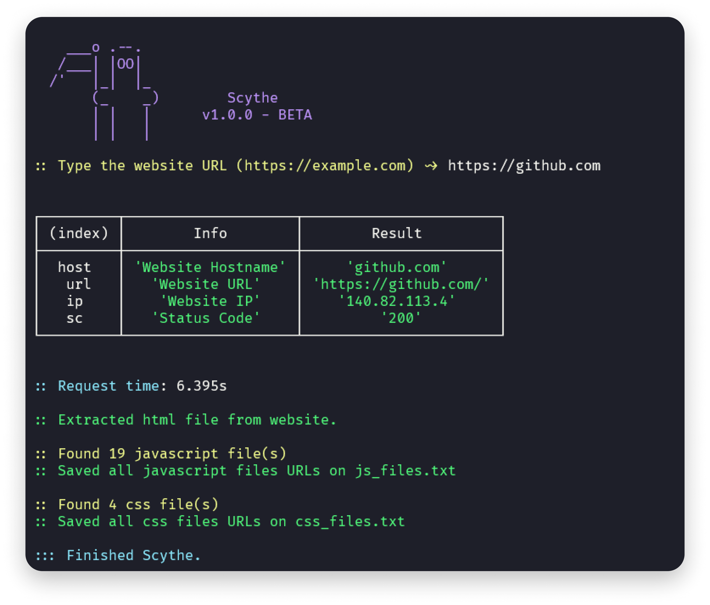

# Scythe <br> 

 <br>


> 💀 Website Stealer

A tool with educational purpose for quick collection of files from a website.

<br><br>

## ⚡ Installing / Getting started

A quick guide of how to install and use Scythe.

```shell
1. Clone the repository with git clone https://github.com/oppsec/Scythe.git
2. Install the libraries with npm install
3. Execute Scythe with node index.js
4. Type the website URL. WARNING: The URL needs to have http:// or https://
5. Scythe will do his job.
```

<br><br>

### ⚙️ Prerequisites
- [NodeJS](http://nodejs.org/) installed on your machine 

<br><br>

### 🔨 Contributing

A quick guide of how to contribute with the project.

```shell
1. Create a fork from Scythe repository
2. Download the project with git clone https://github.com/your/scythe.git
3. cd scythe-folder/
4. Make your changes
5. Commit and make a git push
6. Open a pull request
```

<br><br>

## 📚 License
- MIT License.

<br><br>

## ⚠️ Warning
- I am not responsible for any misuse of this tool, you know what you are doing.